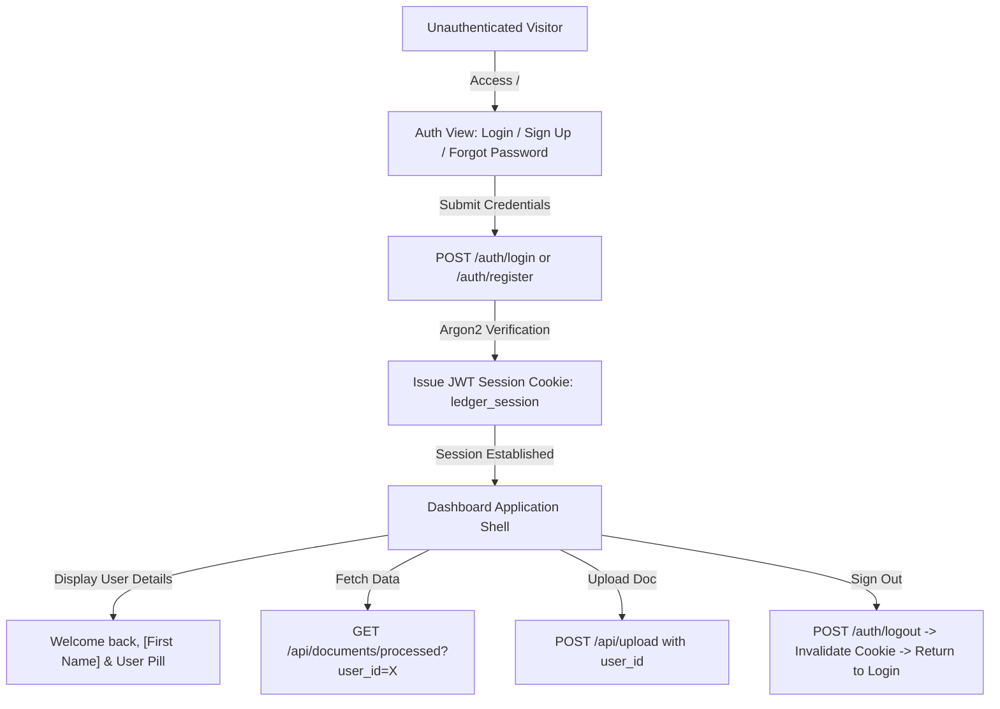

# Ledger — Authentication & Document Security Walkthrough

A complete, production-grade, multi-tenant authentication and user session system has been implemented for Ledger. Unauthenticated users are barred from accessing protected application resources, while authenticated users enjoy secure sessions, role isolation, and access to their financial documents.

---

## 1. Architectural Highlights

### Security & Multi-Tenancy Features
1. **Password Security**:
   - Uses Argon2id via `argon2-cffi` (`PasswordHasher()`), resisting GPU brute-force attacks.
   - Passwords are never stored in plain text or returned across API responses.
2. **Session Authentication**:
   - Secure HTTP-Only cookie `ledger_session` containing a cryptographically signed JWT token (`pyjwt`).
   - Supports "Remember me" extension (7-day vs 24-hour expiration).
   - FastAPI dependency `auth.get_current_user` extracts tokens from cookies or `Authorization: Bearer <token>` headers.
3. **Multi-Tenant Document Ownership**:
   - Database schema migrated: `doc_results` and `documents` include `user_id INTEGER REFERENCES users(id)`.
   - All query endpoints (`/api/documents/processed`, `/classification`, `/metrics`, `/analysis`, `/summary`, `/insights`, `/anomalies`, `/ask`, `DELETE`) check `user_id`.
   - Attempting to access another user's document strictly returns **`403 Forbidden`** (preventing IDOR attacks).
   - Historical documents were seamlessly linked to the default Demo User (`demo@ledger.ai`).

---

## 2. Implemented Endpoints & UI Components

### Backend Endpoints
- `POST /auth/register`: Creates new user account with validation (full name, valid email, min 6 char password, matching confirmation, duplicate rejection).
- `POST /auth/login`: Authenticates email/password, sets HTTP-only session cookie.
- `GET /auth/me`: Returns safe user profile (`id`, `full_name`, `email`).
- `POST /auth/logout`: Clears session cookie and logs user out.
- `POST /auth/forgot-password`: Generates secure password reset token.
- `POST /auth/reset-password`: Consumes reset token and updates password hash.

### Frontend UI (`webapp/index.html`, `style.css`, `app.js`)
- **Login Card**: Brand header, email/password inputs with show/hide toggle, "Remember me", loading spinner, error banners, switch to Sign Up.
- **Sign Up Card**: Full Name, email, password & confirm password validation, auto-login upon creation.
- **Forgot Password Card**: Safe reset token flow with dev fallback form.
- **Topbar Profile Bar**: Initial avatar pill, User name, User email, and Logout button.
- **Welcome Greeting**: Personalizes topbar header with `"Welcome back, [First Name]"`.

---

## 3. Automated Verification Results

A comprehensive end-to-end test suite (`scratch/test_complete_auth.py`) executed against the running backend server:

| Test Case | Description | Result |
| :--- | :--- | :---: |
| **Test 1** | Block unauthenticated access to `/auth/me`, `/api/documents`, `/api/upload` | **401 Unauthorized** |
| **Test 2** | Demo user login (`demo@ledger.ai`) & access to 6 historical documents | **Passed** |
| **Test 3** | Registration validation (mismatched passwords, short passwords, duplicate emails) | **Passed** |
| **Test 4** | User A registration, document upload, and 8-stage pipeline execution | **Passed** |
| **Test 5** | Multi-tenant isolation: User B cannot see or query User A's documents | **403 Forbidden** |
| **Test 6** | Forgot password flow, reset token verification, and password update | **Passed** |
| **Test 7** | Session logout, cookie deletion, and revocation | **Passed** |

---

## 4. Default Demo Account Credentials
- **Email**: `demo@ledger.ai`
- **Password**: `DemoUser123!`
